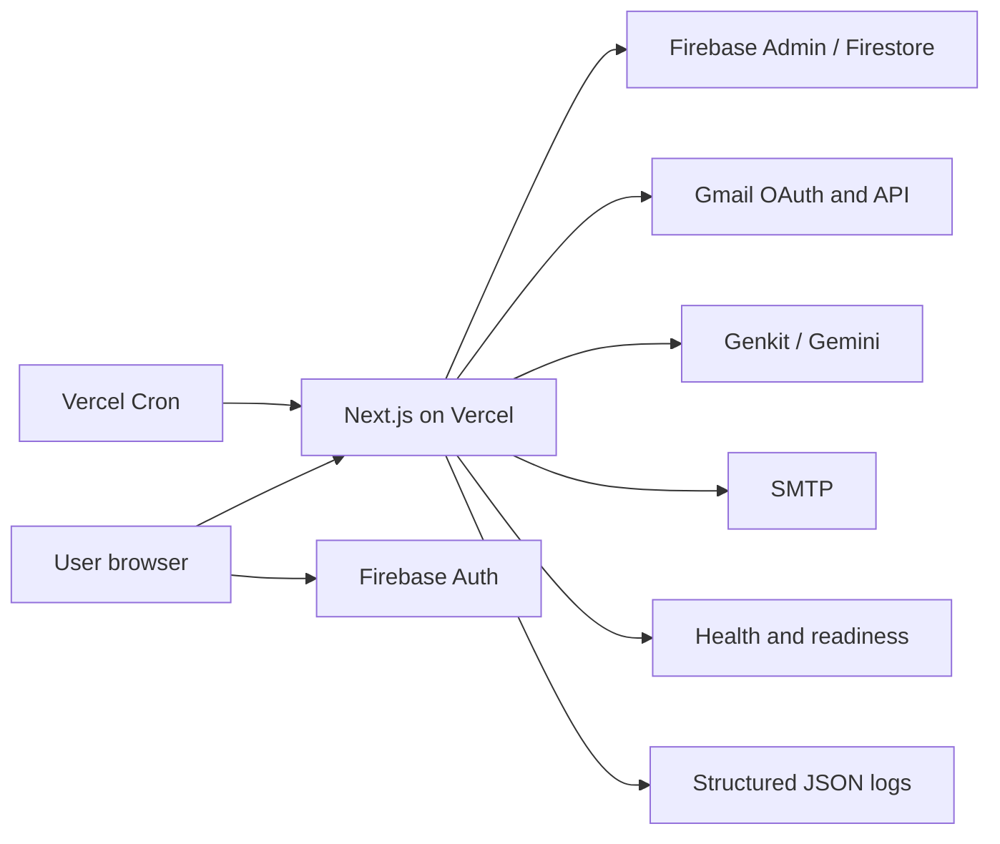
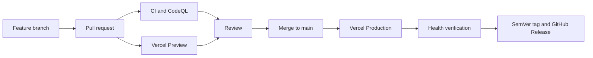

# SubZero

AI-powered subscription intelligence with production-grade delivery engineering.

[Live demo](https://smart-subscription-manager.vercel.app) · [Latest release](https://github.com/KevinGeorge100/smart-subscription-manager/releases/tag/v1.0.0) · [CI](https://github.com/KevinGeorge100/smart-subscription-manager/actions/workflows/ci.yml) · [CodeQL](https://github.com/KevinGeorge100/smart-subscription-manager/actions/workflows/codeql.yml)

**Production:** Live · **Release:** v1.0.0 · **CI:** Passing · **Container:** Built and smoke-tested in CI

## Why SubZero

Recurring charges are easy to miss when their receipts are spread across inboxes. SubZero connects Gmail accounts, finds likely subscriptions in receipts, and uses Gemini to normalize the extracted details. The dashboard turns those records into renewal and spending views that users can review and manage.

## Key Features

- **Gmail discovery:** OAuth connection for multiple Gmail accounts and user-initiated receipt scanning. The dashboard also checks whether the last sync is at least 24 hours old when it loads.
- **AI extraction:** Genkit and Gemini extract subscription details from candidate emails.
- **Ask SubZero:** The assistant answers dashboard questions using selected subscription fields.
- **Financial analytics:** Spending trends, projections, and annual-plan savings estimates.
- **Renewal reminders:** Authenticated Vercel cron job sends upcoming-renewal email and dashboard notifications.
- **Monthly financial pulse:** Authenticated monthly cron job emails a spending and renewal summary to eligible users.

## Production Architecture



The browser holds the Firebase client session. Protected server actions and AI routes verify Firebase identity before privileged Firestore operations. Gmail tokens are encrypted before storage; email content is used for extraction and is excluded from application logs. See the [architecture guide](./docs/ARCHITECTURE.md) for data flow and trust boundaries.

## DevOps & Production Engineering



| Capability | Implementation |
| --- | --- |
| Quality gates | GitHub Actions: `npm ci`, TypeScript, lint, tests, production build, Docker build and smoke test |
| Security scanning | CodeQL, Dependabot, and a nonblocking npm audit signal |
| Container | Multi-stage Node 20 image, Next.js standalone output, non-root runtime |
| Hosting | Vercel Production from `main`; branch/PR Preview deployments |
| Data and identity | Firebase Auth, Firestore, and server-side Firebase Admin verification |
| Operations | `/api/health`, `/api/ready`, structured JSON events, request IDs |
| Scheduled work | Bearer-authenticated renewal reminder and monthly pulse routes |
| Releases | Semantic Versioning, annotated tags, validated GitHub Releases |
| Recovery | Vercel rollback where available, or a history-preserving Git revert |
| Sensitive token storage | AES-256-GCM encryption for stored Gmail OAuth tokens |

The Docker image is a portable alternate runtime; Vercel remains the primary production host. The release workflow validates a tagged `main` commit and creates a GitHub Release without redeploying production.

## Engineering Challenges Solved

- **Secure multi-tenant operations:** Server actions verify the Firebase ID token and use its UID for privileged access, rejecting a conflicting caller-supplied UID.
- **Reliable scheduled workloads:** Cron routes use Bearer authentication and explicit Vercel schedules. The removed Gmail sync cron is not part of the deployment; Gmail sync runs from the application.
- **Portable runtime:** Next.js standalone output is packaged into a small production image that runs as a non-root user, independently of Vercel.
- **Operational visibility:** Liveness and readiness probes, structured events, safe metadata, and request IDs make failures searchable without logging tokens or email bodies.

## Run Locally

```bash
git clone https://github.com/KevinGeorge100/smart-subscription-manager.git
cd smart-subscription-manager
npm ci
npm run dev
```

The development server listens on [http://localhost:9002](http://localhost:9002). Create an ignored `.env.local` with values for the features you use:

| Configuration | Variables |
| --- | --- |
| Public Firebase build configuration | `NEXT_PUBLIC_FIREBASE_API_KEY`, `NEXT_PUBLIC_FIREBASE_AUTH_DOMAIN`, `NEXT_PUBLIC_FIREBASE_PROJECT_ID`, `NEXT_PUBLIC_FIREBASE_STORAGE_BUCKET`, `NEXT_PUBLIC_FIREBASE_MESSAGING_SENDER_ID`, `NEXT_PUBLIC_FIREBASE_APP_ID`, `NEXT_PUBLIC_APP_URL` |
| Core server runtime | `FIREBASE_PROJECT_ID`, `FIREBASE_CLIENT_EMAIL`, `FIREBASE_PRIVATE_KEY` |
| Gmail OAuth | `GOOGLE_CLIENT_ID`, `GOOGLE_CLIENT_SECRET`, `GOOGLE_REDIRECT_URI`, `ENCRYPTION_KEY` |
| Gemini | `GOOGLE_GENAI_API_KEY` or `GEMINI_API_KEY` |
| Email and scheduled jobs | `SMTP_HOST`, `SMTP_PORT`, `SMTP_USER`, `SMTP_PASS`, `CRON_SECRET` |

Public variables are embedded at build time; server credentials must be injected at runtime. For a local production simulation, use `docker compose --env-file .env.local build` and `docker compose --env-file .env.local up`. See the [deployment guide](./docs/DEPLOYMENT.md) for environment and rollback details.

## Quality Gates

```bash
npm run typecheck
npm run lint
npm test
npm run build
```

The current suite has **30 passing tests**. CI also validates the production container and probes `/api/health`.

## Documentation

- [Architecture](./docs/ARCHITECTURE.md)
- [Deployment guide](./docs/DEPLOYMENT.md)
- [Operations runbook](./docs/RUNBOOK.md)
- [Release checklist](./docs/RELEASE_CHECKLIST.md)
- [Changelog](./CHANGELOG.md)
- [Project abstract](./docs/ABSTRACT.md)
