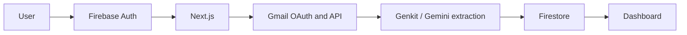

# System Overview

SubZero is a Next.js 15 App Router application hosted primarily on Vercel. Firebase Auth identifies users, Firestore stores their subscription and account records, Gmail supplies receipt candidates, and Genkit/Gemini extracts subscription details. Next.js routes and server actions handle privileged operations. A standalone Docker image provides an alternate runtime.

# Components

| Component | Responsibility |
| --- | --- |
| Browser and Next.js UI | Authentication session, dashboard, analytics, sync controls, and assistant interface. |
| Next.js server routes and actions | Protected paths verify Firebase tokens and enforce UID ownership; server code orchestrates Gmail/AI operations and accesses Firebase Admin. |
| Firebase Auth and Firestore | User identity and persistent records for users, subscriptions, connected accounts, and notifications. |
| Gmail OAuth/API | Obtain authorized read-only Gmail access and scan candidate receipts. |
| Genkit/Gemini | Extract structured subscription fields and answer dashboard questions using selected subscription context. |
| SMTP and Vercel Cron | Send renewal reminders and monthly pulse emails on the schedules in `vercel.json`. |

# Request/Data Flow

The user can connect multiple Gmail accounts and initiate a sync. On dashboard load, the client also requests a sync when the previous sync is at least 24 hours old. The server reads Gmail messages with the granted scope, sends candidate content to extraction, deduplicates detected subscriptions, and saves records under the authenticated user's Firestore path. The UI reads those records for analytics and chat context. There is no scheduled Gmail sync route.

# Trust Boundaries

- **Browser:** Untrusted caller. Firebase client configuration is public; the browser presents an ID token or session token for protected server operations. Caller-supplied UIDs are not authorization evidence.
- **Next.js server:** Protected actions and AI routes verify Firebase identity and use the verified UID for privileged operations. The Gmail OAuth callback handles a separate redirect flow. Runtime credentials stay server-side; logs accept only safe metadata.
- **Firebase Admin / Firestore:** Server credentials authorize privileged reads and writes. User records are partitioned by UID. The client Firestore path is also subject to Firestore security rules.
- **Gmail:** OAuth grants read-only mailbox access. Refresh tokens are encrypted with AES-256-GCM before Firestore storage. Email bodies are processed for extraction and must not enter application logs.
- **Gemini:** Candidate email text or selected subscription context crosses to the external AI provider. Prompts and responses are excluded from structured application logs.

The OAuth callback currently uses a user ID in its `state` parameter; binding that state cryptographically to the initiating authenticated session remains a security review item.

# Deployment Architecture

GitHub Actions checks pull requests and `main` with typecheck, lint, tests, application build, Docker build, and a container smoke test. CodeQL analyzes the repository. Vercel Git integration creates Preview deployments for branch work and Production deployments from `main`. A validated SemVer tag triggers a separate release workflow and GitHub Release; it does not redeploy Vercel. The Docker image runs Next.js standalone as a non-root user with runtime-injected secrets. See [deployment](DEPLOYMENT.md).

# Background Jobs

Vercel schedules `/api/cron/send-reminders` daily and `/api/cron/pulse` monthly. Both require a Bearer token matching `CRON_SECRET`. The reminder job queries upcoming renewals, sends eligible emails, and writes notifications. The pulse job reads users and their subscriptions and sends a monthly summary to eligible users. Gmail synchronization is triggered by the user or dashboard stale-sync behavior, not by cron.

# Observability

`/api/health` checks process liveness. `/api/ready` reports whether core Firebase Admin configuration names are present without contacting Firebase. Critical server paths emit structured JSON events with component, event, duration/count metadata, and request IDs where available. Vercel function logs or container stdout/stderr can be filtered by these fields. See the [runbook](RUNBOOK.md).

# Security Controls

Firebase token verification and UID ownership checks protect privileged server operations. Cron routes use Bearer authentication. Gmail refresh tokens are encrypted at rest in application storage. The logger discards unapproved metadata and normalizes external error messages. CodeQL, Dependabot, and CI checks provide repository-level signals; npm audit is currently nonblocking because upstream dependency findings remain.

# Known Scaling Constraints

- The monthly pulse reads each user's subscriptions separately (an N+1 Firestore query pattern) and sends SMTP messages sequentially. Runtime grows with user count.
- Vercel API functions have a 30-second maximum duration in `vercel.json`; larger scans or email batches can exceed it.
- Gmail sync and AI extraction depend on third-party quotas and latency. Current health/readiness endpoints do not measure those providers.
- Structured logs provide searchability, but there is no external APM, alerting, or metrics backend yet.
